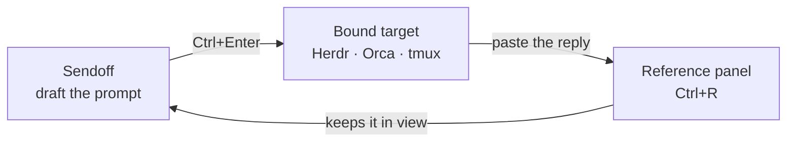

<div align="center">


# Sendoff

**A prompt-first editor for terminal coding agents — fast, local, keyboard-driven.**


[Website](https://sendoff-editor.pages.dev) · English · [Русский](README.ru.md)

</div>

<div align="center">


<sub>Draft the prompt → <code>Ctrl+Enter</code> → it arrives in the <code>tmux</code> pane running your agent
as a single block, already submitted.</sub>

</div>

Sendoff is a minimal text editor built around one workflow: write a prompt in a
real editing surface, then fire it straight into the terminal agent you're
already running. It was born from a concrete annoyance — the cramped input box
in Claude Code and the awkward scrollback in long `tmux` sessions. Sendoff gives
the prompt room to breathe before it's sent.

No backend, no API keys, no telemetry, no network calls from the editor at all.

> **Not** a pipeline builder, a knowledge base, or a code editor — by design.

## Download

Grab the AppImage from the [latest release](https://github.com/exviolet/sendoff/releases/latest):

```bash
chmod +x Sendoff_*_amd64.AppImage
./Sendoff_*_amd64.AppImage
```

Needs **glibc ≥ 2.35** — Ubuntu 22.04+, Debian 12+, Fedora 36+, Arch. It is built
in a container on Ubuntu 22.04 for exactly that reason; an AppImage bundles its
libraries but *not* glibc, so building on a rolling distro would produce a file
that only runs on rolling distros.

It expects a normal desktop system for the libraries AppImage deliberately does
not bundle — graphics and text shaping: `libGL`, `libEGL`, `libgbm`, `libdrm`,
`libX11`, `libX11-xcb`, `libxcb`, `libfontconfig`, `libfreetype`, `libharfbuzz`,
`libfribidi`, `libexpat`. Any Linux desktop has them; a bare container does not.
Everything else, WebKitGTK included, travels inside the AppImage — verified by
running it on a container with zero webkit and zero GTK packages installed, where
it gets all the way to "Failed to initialize GTK", i.e. it stops at the missing
display rather than at a missing symbol.

> ⚠️ **Don't mix the AppImage and a source build on the same machine.** Both use
> the same data directory, but the AppImage bundles WebKitGTK 2.50 while a current
> distribution ships 2.52+. From 2.52 on, WebKit writes IndexedDB in a new metadata
> format and **silently upgrades the database the first time it opens it** — after
> which the AppImage can no longer read it, and shows an empty editor plus a storage
> error. Your data is intact and is never overwritten: when Sendoff cannot read, it
> stops writing altogether. Go back to whichever build you were using before and
> your tabs are there. The incompatibility is one-way — newer WebKit reads older
> databases, not the other way round.

No auto-update — to upgrade, download the new AppImage, or build from source and
use `./update.sh`.

## The core loop



Draft the prompt → `Ctrl+Enter` sends it to the terminal the tab is bound to →
keep the agent's reply pinned in the reference panel while you write the next one.

## Features

**Prompt workflow**
- **Send the prompt** (`Ctrl+Enter`) — push the current buffer into the terminal
  the tab is bound to, without leaving the keyboard. Three kinds of target are
  supported: [Herdr](https://herdr.dev) agents (**0.7 or newer** — pane ids changed
  shape after 0.6 and the older form is rejected by the command allowlist),
  [Orca ADE](https://github.com/stablyai/orca) agents, and plain `tmux` panes.
  Multi-line prompts arrive as one block and are submitted once.
- **Target picker** (`Ctrl+Shift+Enter`) — one list, sectioned by source, so you
  pick an agent or a pane by name instead of relying on whatever is focused.
  A source that is not running simply has no section.
- **Sendoff Doctor** (`Ctrl+Shift+P` → *Sendoff Doctor*) — when the picker comes up
  empty, this says why instead of leaving you to guess. Per target it reports whether
  the executable is visible in *Sendoff's own* `PATH` (a GUI launch does not inherit
  your shell's), whether discovery actually ran, and the live handle the target hands
  back — the exact shape a send is validated against. It also prints the versions that
  decide whether your data is readable at all: Sendoff, Tauri, WebKitGTK and the data
  directory. It only reports — it fixes and configures nothing.
- **Tab binding** (`Ctrl+Alt+B` / `Ctrl+Alt+Shift+B`) — pin a tab to one target;
  the status bar shows the live binding so `Ctrl+Enter` always lands in the right
  place. Bindings store a stable descriptor and resolve the live handle on every
  send, so they survive restarts. **When a binding is ambiguous, Sendoff asks
  instead of guessing** — a prompt in the wrong agent is worse than an extra click.
- **Live agent status** — the status bar shows what the bound agent is doing.
  It stays a quiet dot while the agent works, and speaks up only when the agent
  is blocked waiting for *your* answer.
- **Trigger phrases** (`Ctrl+K`) — reusable prompt fragments. By default they go
  in front of the whole prompt (they are usually role prefixes); a setting
  switches insertion to the caret instead.
- **Slash menu** (`/`) — the only trigger with no modifier at all. Typing `/` at
  the start of a line or after a space opens an inline list: your trigger
  phrases first, then markdown scaffolding (code block, headings, lists,
  horizontal rule). It stays out of the way — a slash inside a word (`src/lib`,
  `12/08`) is just text, `Escape` dismisses that slash for good, and phrases
  picked here always land at the caret.
- **Images by path** — paste a screenshot (`Ctrl+V`) or pick a file from the
  palette, and Sendoff drops its absolute path into the prompt. Coding agents
  read images from a path, so this is what actually reaches them: the terminal
  carries text, not pixels. A pasted image is written into Sendoff's own data
  directory; a picked file is referenced where it already lies, never copied.
- **Reference panel** (`Ctrl+R`) — a resizable, persisted side panel to keep an
  agent's reply visible while you compose the follow-up.

**Tabs that scale**
- Tabbed editor with drag-and-drop reorder; survives restarts (75+ tabs daily).
  Moving a tab never depends on a navigation cluster: `Ctrl+Shift+,` / `Ctrl+Shift+.`
  work on 60% keyboards where `PgUp`/`PgDn` live on a function layer.
- Tabs auto-name themselves from the first line; empty tabs auto-clean.
- **Workspaces** (`Ctrl+Shift+W`) — group tabs by project; the tab bar shows
  only the active workspace, and pins are per-workspace. `F2` opens rename and
  delete inside the switcher itself — deleting a workspace moves its tabs to the
  next one instead of discarding them, and says so before you commit.
- **Tab groups** (`Ctrl+G`) — colour-coded, named runs inside a workspace; collapse
  a group to a single chip, drag it as a whole, or act on several tabs at once with
  `Ctrl`+click. Collapsing only hides — it never closes anything.
- **Tab switcher** (`Ctrl+T`) with a live content preview.
- **Global tab search** (`Ctrl+Shift+D`) — full-text search across every tab,
  deliberately cross-workspace (the escape hatch out of isolation).
- **Pin tabs** (`Ctrl+P`) — keep important drafts pinned at the front of the tab bar.

**Text tooling**
- **Markdown editing** — `Ctrl+B` / `Ctrl+I` wrap (and unwrap) the selection or the
  word under the cursor; `Tab` / `Shift+Tab` indent and nest list items; `Enter`
  continues lists, numbering, checkboxes and blockquotes, and clears the marker on
  an empty item; brackets, quotes and backticks close around a selection, and a
  third backtick opens a fenced code block.
- Find & Replace with a real-time highlight overlay.
- Bulk find & replace with a diff preview before applying.
- **Replace presets** — reusable bulk-replacement rule sets (the original use
  case: tone conversion, e.g. `You/Your` → collaborative `We/Our`).
- Markdown preview, distraction-free mode, command palette (`Ctrl+Shift+P`).

**Under the hood**
- Autosave to IndexedDB — close and reopen, everything's there. There is no manual
  save: `Ctrl+S` only flushes the pending write immediately.
- Closing a tab deletes nothing: it moves to an archive that survives restarts and
  comes back with `Ctrl+Shift+T`.
- Native file dialogs, drag-and-drop files into the editor, file import/export
  (`.txt`, `.md`), plus full backup export/import.
- Custom title bar with window controls; follows the native window theme.
  Light / dark / system, and a configurable editor font (`Ctrl+,`).
- **Exactly one instance runs.** Launching again exits immediately instead of
  opening a second window. Two copies on one database would quietly eat each
  other's work — a save rewrites the whole snapshot, so the instance with the
  staler view wins and deletes whatever the other one created. The second launch
  does ask the existing window to come forward, but Wayland compositors ignore an
  activation request from a process you did not just interact with, so nothing
  visibly happens there — measured on niri, both from the AppImage and a source build.

## Keyboard shortcuts

Every shortcut is rebindable — open the reference with `Ctrl+/` and click a chord
to record a new one.

| Shortcut | Action |
|----------|--------|
| `Ctrl+Enter` | Send buffer to the bound terminal (Herdr / Orca / tmux) |
| `Ctrl+Shift+Enter` | Target picker (Herdr / Orca / tmux) |
| `Ctrl+Alt+B` / `Ctrl+Alt+Shift+B` | Bind / unbind tab to a terminal |
| `Ctrl+B` / `Ctrl+I` | Bold / italic (selection or word under the cursor) |
| `Ctrl+M` / `Ctrl+Shift+M` | Inline code / fenced code block |
| `Tab` / `Shift+Tab` | Indent / outdent — nests list items |
| `Ctrl+V` | Paste an image → its path lands in the prompt (text pastes as usual) |
| `Ctrl+R` | Toggle reference panel |
| `Ctrl+K` | Trigger phrases |
| `/` | Insert menu — trigger phrases and markdown scaffolding |
| `Ctrl+T` | Tab switcher (with preview) |
| `Ctrl+Shift+W` | Workspace switcher |
| `Ctrl+G` | Put the tab into a group (picker with a create row) |
| `Ctrl+Shift+D` | Global tab search |
| `Ctrl+P` | Pin / unpin current tab |
| `Ctrl+N` / `Ctrl+W` | New / close tab |
| `Ctrl+Shift+T` | Reopen closed tab |
| `Ctrl+Tab` / `Ctrl+Shift+Tab` | Next / previous tab |
| `Ctrl+Shift+,` / `.` | Move the tab left / right along the bar |
| `Ctrl+Shift+PgUp` / `PgDn` | Same, for keyboards with a nav cluster |
| `Ctrl+Z` / `Ctrl+Shift+Z` | Undo / redo |
| `Ctrl+F` / `Ctrl+H` | Find / Find & Replace |
| `Ctrl+Shift+P` | Command palette |
| `Ctrl+S` / `Ctrl+O` | Flush the pending write now (it is automatic) / open file |
| `Ctrl+.` | Toggle presets sidebar |
| `Alt+M` | Markdown preview |
| `Ctrl+E` | Focus the editor |
| `Ctrl+Shift+F` | Distraction-free mode |
| `Ctrl+Shift+A` | Scroll to the active tab |
| `Ctrl+,` | Settings |
| `Ctrl+/` | Shortcuts reference (and rebinding) |
| `Escape` | Close panels |

## Security boundary

The editor makes **no network calls** and spawns **no arbitrary processes**. The
webview gets a deliberately narrow shell surface: `tmux`, plus `orca-ide` and
`herdr` scoped to individual read/send subcommands. Scoping matters most for
`herdr` — the same binary can also run arbitrary processes and tear down
sessions, so it is allowlisted per subcommand rather than wholesale.

Writing files is deliberately narrower than it looks. Saving a pasted image does
**not** go through the filesystem plugin: its `fs:allow-write-file` permission
enables three commands at once — `write_file`, `open` and `write` — which, paired
with the home-directory scope, is a generic open-and-write over your whole home.
Instead there is one app command that takes bytes and nothing else: the directory
comes from the app's own data path, the filename is generated, and the format is
detected from the file signature, so the webview never names a destination. That
command is listed in the ACL like a plugin one, so it stays visible in the manifest.

Home-directory file access is only safe because of that boundary. The full
manifest is `src-tauri/capabilities/default.json`.

## Build from source

### Requirements

- [Bun](https://bun.sh/) ≥ 1.0
- [Rust](https://rustup.rs/) (stable)
- Tauri system dependencies (Linux):
  - **Arch**: `webkit2gtk-4.1`, `gtk3`, `libsoup3`
  - **Ubuntu/Debian**: `libwebkit2gtk-4.1-dev`, `libgtk-3-dev`, `libsoup-3.0-dev`

> Linux-only by design. No Windows/macOS builds, no auto-update.

### Setup

```bash
git clone https://github.com/exviolet/sendoff.git
cd sendoff
bun install
```

### Develop

```bash
bun dev      # Vite dev server + Tauri window
```

### Build & install

```bash
bun run build:bin   # build just the binary (tauri build --no-bundle)
./install.sh        # install to ~/.local/ (binary + .desktop + icon)
./uninstall.sh      # remove
```

`build:bin` skips AppImage/deb/rpm bundling — you don't need them for a
`~/.local/bin` install. The full `bun run build` produces all three. After
`install.sh` the app shows up in rofi / your app launcher.

### Update an installed copy

```bash
./update.sh   # git pull + build:bin + install
```

Pulls `master`, rebuilds the binary, and reinstalls in one step. Restart the
app from your launcher after.

> Close the app before updating. `install.sh` refuses to run while an instance is
> alive, because the data directory can move between versions.

### Release artifacts

Release AppImages are built inside a container so they stay usable on older
distributions (see [Download](#download) for why):

```bash
docker build -t sendoff-appimage-builder .
docker run --rm -v "$PWD":/src -u "$(id -u):$(id -g)" -e HOME=/tmp \
  -e CARGO_TARGET_DIR=/src/src-tauri/target-docker \
  sendoff-appimage-builder bash -lc 'bun install && bun run build'
```

The artifact lands in `src-tauri/target-docker/release/bundle/appimage/`. Only
the AppImage is published: the `.deb` and `.rpm` come out of the same build but
have never been installed on a Debian or Fedora system, and shipping untested
packages is a promise this project cannot back.

## Repo layout

This repo is the product: the Tauri v2 shell, the release artifacts, and the
integrations that make `Ctrl+Enter` land in a terminal.

The editor itself — React + Zustand + Vite — lives in `web/`, with its own
`package.json`; Tauri installs and builds it from there. Until August 2026 it was
a separate repository pinned as a git submodule, which bought nothing: the
frontend depends on `@tauri-apps/*`, `Ctrl+Enter` degrades to a clipboard copy in
a plain browser tab, and nothing consumed it on its own.

## Status

A personal tool, used daily on Linux, on `v0.2.x`. Public so it can serve as a
portfolio piece — **it works for me, but no support or stability is guaranteed.**
Expect fast, unannounced breaking changes.

Honest scope, so nobody wastes an evening: Linux-only, x86_64 only, no
auto-update, no data migrations (breaking changes land as clean sweeps), and
issues may sit. Tests cover pure logic and the IndexedDB layer only — components
and hooks are not covered on purpose. Contributions aren't being solicited —
fork freely instead.

> Formerly called **Rewrite**. Renamed in August 2026: the name read as
> "AI paraphraser" — which is the one thing this editor deliberately is not —
> and collided with [OpenRewrite](https://github.com/openrewrite/rewrite).

## Credits

Bundles [JetBrains Mono](https://www.jetbrains.com/lp/mono/) (v2.304), licensed
under the [SIL Open Font License 1.1](web/public/assets/fonts/JetBrainsMono-OFL.txt).
A system Nerd Font is preferred when present, so agent output keeps its icons.

## License

[MIT](LICENSE)
