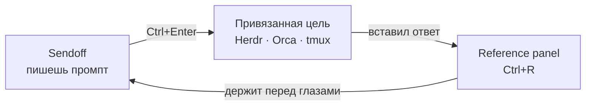

<div align="center">


# Sendoff

**Prompt-first редактор для терминальных агентов — быстрый, локальный, на клавиатуре.**


[Сайт](https://sendoff-editor.pages.dev) · [English](README.md) · Русский

</div>

<div align="center">


<sub>Пишешь промпт → <code>Ctrl+Enter</code> → он приезжает в <code>tmux</code>-пейн с твоим агентом
одним блоком и сразу отправленным.</sub>

</div>

Sendoff — минималистичный текстовый редактор вокруг одного сценария: написать
промпт на нормальной поверхности для ввода и отправить его прямо в терминальный
агент, который уже запущен. Возник из конкретной боли — тесный input в Claude
Code и неудобный scrollback в долгих `tmux`-сессиях. Sendoff даёт промпту место,
прежде чем тот уйдёт в агента.

Без бэкенда, без API-ключей, без телеметрии и вообще без сетевых вызовов из редактора.

> **Не** pipeline-builder, **не** база знаний и **не** редактор кода — намеренно.

## Скачать

Возьми AppImage из [последнего релиза](https://github.com/exviolet/sendoff/releases/latest):

```bash
chmod +x Sendoff_*_amd64.AppImage
./Sendoff_*_amd64.AppImage
```

Нужен **glibc ≥ 2.35** — Ubuntu 22.04+, Debian 12+, Fedora 36+, Arch. Он и собран
в контейнере на Ubuntu 22.04 ровно поэтому: AppImage бандлит свои библиотеки, но
**не** glibc, так что сборка на rolling-дистрибутиве дала бы файл, который
запускается только на rolling-дистрибутивах.

Ожидается обычная десктопная система — из-за библиотек, которые AppImage намеренно
не бандлит; это графика и отрисовка текста: `libGL`, `libEGL`, `libgbm`, `libdrm`,
`libX11`, `libX11-xcb`, `libxcb`, `libfontconfig`, `libfreetype`, `libharfbuzz`,
`libfribidi`, `libexpat`. На любом Linux-десктопе они есть, в голом контейнере — нет.
Всё остальное, включая WebKitGTK, едет внутри AppImage — проверено запуском на
контейнере с нулём webkit- и gtk-пакетов, где он доходит до «Failed to initialize
GTK», то есть упирается в отсутствие дисплея, а не в отсутствие символа.

> ⚠️ **Не смешивай AppImage и сборку из исходников на одной машине.** Каталог
> данных у них общий, но AppImage несёт внутри WebKitGTK 2.50, а современный
> дистрибутив даёт 2.52+. Начиная с 2.52 WebKit пишет IndexedDB в новом формате
> метаданных и **молча повышает базу при первом же открытии** — после чего
> AppImage её больше не прочитает и покажет пустой редактор с ошибкой хранилища.
> Данные при этом целы и никогда не перезаписываются: не сумев прочитать, Sendoff
> вообще прекращает запись. Вернись к той сборке, которой пользовался, и табы на
> месте. Несовместимость односторонняя — новый WebKit читает старые базы, наоборот
> не работает.

Авто-обновления нет: чтобы обновиться, скачай новый AppImage либо собери из
исходников и запусти `./update.sh`.

## Основной цикл



Написал промпт → `Ctrl+Enter` отправляет его в терминал, к которому привязан таб →
держишь ответ агента закреплённым в reference panel, пока пишешь следующий.

## Возможности

**Prompt-workflow**
- **Отправка промпта** (`Ctrl+Enter`) — пушит текущий буфер в терминал, к которому
  привязан таб, не отрывая рук от клавиатуры. Поддержаны три вида целей: агенты
  [Herdr](https://herdr.dev) (**0.7 и новее** — после 0.6 сменился вид id панелей,
  старую форму отклоняет allowlist команд), агенты
  [Orca ADE](https://github.com/stablyai/orca) и обычные `tmux`-пейны.
  Многострочный текст долетает одним блоком, сабмит один.
- **Пикер целей** (`Ctrl+Shift+Enter`) — один список с секциями по источникам:
  выбираешь агента или пейн по имени, а не полагаешься на то, что сейчас в фокусе.
  Незапущенный источник просто не даёт секции.
- **Sendoff Doctor** (`Ctrl+Shift+P` → *Sendoff Doctor*) — когда пикер пуст, показывает
  почему, а не оставляет гадать. По каждой цели: виден ли бинарь в *собственном*
  `PATH` Sendoff (GUI-запуск не наследует шелловый), отработал ли discovery и какой
  живой хендл цель возвращает — ровно ту форму, против которой валидируется отправка.
  Там же — версии, от которых зависит, читаемы ли данные вообще: Sendoff, Tauri,
  WebKitGTK и каталог данных. Только показывает — ничего не чинит и не настраивает.
- **Привязка таба** (`Ctrl+Alt+B` / `Ctrl+Alt+Shift+B`) — закрепить таб за одной целью;
  status bar показывает живую привязку, так что `Ctrl+Enter` всегда летит туда, куда
  надо. Привязка хранит стабильный дескриптор и резолвит живой хендл на каждой
  отправке, поэтому переживает рестарты. **Если цель неоднозначна, Sendoff
  переспросит, а не угадает:** промпт, улетевший не тому агенту, хуже лишнего клика.
- **Живой статус агента** — status bar показывает, чем занят привязанный агент.
  Пока агент работает, это тихая точка; голос он подаёт только когда агент
  остановился и ждёт *твоего* ответа.
- **Фразы-триггеры** (`Ctrl+K`) — переиспользуемые куски промптов. По умолчанию встают
  перед всем промптом (обычно это префиксы-роли); настройкой переключаются на вставку
  в позицию каретки.
- **Слэш-меню** (`/`) — единственный триггер вообще без модификаторов. Слэш в начале
  строки или после пробела открывает инлайн-список: сначала твои фразы-триггеры, затем
  markdown-леса (блок кода, заголовки, списки, черта). Под руку не лезет: слэш внутри
  слова (`src/lib`, `12/08`) остаётся текстом, `Escape` закрывает этот слэш насовсем,
  а фразы отсюда всегда встают в каретку.
- **Картинки путём** — вставь скриншот (`Ctrl+V`) или выбери файл из палитры, и
  Sendoff положит в промпт его абсолютный путь. Агенты читают картинку по пути —
  именно это до них и доезжает: в терминал уходит текст, а не пиксели. Вставленная
  картинка пишется в собственный каталог данных Sendoff; выбранный файл берётся
  там, где лежит, и никуда не копируется.
- **Reference panel** (`Ctrl+R`) — боковая панель с изменяемой и сохраняемой
  шириной, чтобы держать ответ агента перед глазами при написании ответа.

**Табы, которые масштабируются**
- Табы с drag-and-drop, переживают рестарт (75+ табов ежедневно). Перестановка таба
  не зависит от nav-кластера: `Ctrl+Shift+,` / `Ctrl+Shift+.` работают на 60%
  клавиатурах, где `PgUp`/`PgDn` живут на Fn-слое.
- Авто-имя таба из первой строки; пустые табы авто-очищаются.
- **Workspaces** (`Ctrl+Shift+W`) — группировка табов по проектам; таб-бар
  показывает только активный workspace, пины — свои в каждом.
- **Группы табов** (`Ctrl+G`) — именованные цветные run'ы внутри workspace: группу
  можно свернуть в один чип, перетащить целиком или применить действие сразу к
  нескольким табам через `Ctrl`+клик. Сворачивание только прячет, ничего не закрывает.
- **Tab switcher** (`Ctrl+T`) с живым превью содержимого.
- **Глобальный поиск по табам** (`Ctrl+Shift+D`) — полнотекстовый поиск по всем,
  намеренно сквозной по workspace'ам (это escape hatch из изоляции).
- **Закрепление табов** (`Ctrl+P`) — держать важные черновики в начале таб-бара.

**Работа с текстом**
- **Markdown-редактирование** — `Ctrl+B` / `Ctrl+I` оборачивают (и разворачивают)
  выделение или слово под курсором; `Tab` / `Shift+Tab` делают отступ и вкладывают
  пункты списка; `Enter` продолжает списки, нумерацию, чекбоксы и цитаты, а на пустом
  пункте убирает маркер; скобки, кавычки и бэктики закрываются вокруг выделения,
  третий бэктик подряд разворачивается в блок кода.
- Find & Replace с подсветкой совпадений в реальном времени.
- Массовая замена с diff-превью перед применением.
- **Пресеты замен** — переиспользуемые наборы правил (изначальный сценарий:
  конвертация тона, напр. `You/Your` → совместное `We/Our`).
- Markdown-превью, distraction-free режим, командная палитра (`Ctrl+Shift+P`).

**Под капотом**
- Автосохранение в IndexedDB — закрыл и открыл, всё на месте. Ручного «сохранить»
  нет и не было: `Ctrl+S` лишь дожимает отложенную запись немедленно.
- Закрытие таба ничего не удаляет: он уезжает в архив, который переживает перезапуск,
  и возвращается через `Ctrl+Shift+T`.
- Нативные файловые диалоги, drag-and-drop файлов в редактор, импорт/экспорт
  (`.txt`, `.md`) и полный бэкап всей базы.
- Кастомный title bar с кнопками окна; следует нативной теме окна. Светлая /
  тёмная / системная и настраиваемый шрифт редактора (`Ctrl+,`).
- **Работает ровно один инстанс.** Повторный запуск сразу выходит вместо второго
  окна. Две копии на одной базе тихо съели бы работу друг друга: запись
  переписывает снапшот целиком, поэтому инстанс с более старой картиной побеждает
  и стирает созданное другим. Второй запуск просит существующее окно выйти вперёд,
  но Wayland-композиторы игнорируют запрос активации от процесса, с которым
  пользователь только что не взаимодействовал, — так что видимо ничего не
  происходит. Замерено на niri, и на AppImage, и на сборке из исходников.

## Горячие клавиши

Все сочетания переназначаются: открой справку `Ctrl+/` и кликни по сочетанию,
чтобы записать новое.

| Клавиши | Действие |
|---------|----------|
| `Ctrl+Enter` | Отправить буфер в привязанный терминал (Herdr / Orca / tmux) |
| `Ctrl+Shift+Enter` | Пикер целей (Herdr / Orca / tmux) |
| `Ctrl+Alt+B` / `Ctrl+Alt+Shift+B` | Привязать / отвязать таб к терминалу |
| `Ctrl+B` / `Ctrl+I` | Жирный / курсив (выделение или слово под курсором) |
| `Ctrl+M` / `Ctrl+Shift+M` | Инлайн-код / блок кода |
| `Tab` / `Shift+Tab` | Отступ / убрать отступ — вкладывает пункты списка |
| `Ctrl+V` | Вставить картинку → её путь встаёт в промпт (текст вставляется как обычно) |
| `Ctrl+R` | Reference panel |
| `Ctrl+K` | Фразы-триггеры |
| `/` | Меню вставки — фразы-триггеры и markdown-леса |
| `Ctrl+T` | Tab switcher (с превью) |
| `Ctrl+Shift+W` | Переключатель workspace |
| `Ctrl+G` | Положить таб в группу (пикер со строкой создания) |
| `Ctrl+Shift+D` | Глобальный поиск по табам |
| `Ctrl+P` | Закрепить / открепить текущий таб |
| `Ctrl+N` / `Ctrl+W` | Новый / закрыть таб |
| `Ctrl+Shift+T` | Открыть закрытый таб |
| `Ctrl+Tab` / `Ctrl+Shift+Tab` | Следующий / предыдущий таб |
| `Ctrl+Shift+,` / `.` | Сдвинуть таб влево / вправо по полосе |
| `Ctrl+Shift+PgUp` / `PgDn` | То же, для клавиатур с nav-кластером |
| `Ctrl+Z` / `Ctrl+Shift+Z` | Undo / redo |
| `Ctrl+F` / `Ctrl+H` | Поиск / Поиск и замена |
| `Ctrl+Shift+P` | Командная палитра |
| `Ctrl+S` / `Ctrl+O` | Записать сейчас (и так само) / открыть файл |
| `Ctrl+.` | Сайдбар пресетов |
| `Alt+M` | Markdown-превью |
| `Ctrl+E` | Фокус в редактор |
| `Ctrl+Shift+F` | Distraction-free режим |
| `Ctrl+Shift+A` | Доскроллить к активному табу |
| `Ctrl+,` | Настройки |
| `Ctrl+/` | Справка по клавишам (и переназначение) |
| `Escape` | Закрыть панели |

## Граница безопасности

Редактор **не делает сетевых вызовов** и **не спавнит произвольные процессы**.
Webview получает намеренно узкую shell-поверхность: `tmux`, плюс `orca-ide` и
`herdr`, заскоупленные по отдельным read/send-подкомандам. Скоупинг важнее всего
для `herdr` — тот же бинарник умеет запускать произвольные процессы и сносить
сессии, поэтому он разрешён по подкомандам, а не целиком.

Запись файлов уже, чем кажется. Сохранение вставленной картинки идёт **не** через
файловый плагин: его permission `fs:allow-write-file` открывает сразу три команды —
`write_file`, `open` и `write`, — что в паре с home-скоупом даёт универсальную
запись по всему домашнему каталогу. Вместо этого есть одна команда приложения,
принимающая только байты: каталог берётся из собственного пути данных, имя
генерируется, формат определяется по сигнатуре файла — вебвью не называет
назначение вообще. Команда заведена в ACL наравне с плагинными, поэтому остаётся
видимой в манифесте.

Доступ к файлам в home-каталоге безопасен только благодаря этой границе. Полный
манифест — `src-tauri/capabilities/default.json`.

## Сборка из исходников

### Требования

- [Bun](https://bun.sh/) ≥ 1.0
- [Rust](https://rustup.rs/) (stable)
- Системные зависимости Tauri (Linux):
  - **Arch**: `webkit2gtk-4.1`, `gtk3`, `libsoup3`
  - **Ubuntu/Debian**: `libwebkit2gtk-4.1-dev`, `libgtk-3-dev`, `libsoup-3.0-dev`

> Только Linux, намеренно. Сборок под Windows/macOS нет, авто-обновления нет.

### Установка зависимостей

```bash
git clone https://github.com/exviolet/sendoff.git
cd sendoff
bun install
```

### Разработка

```bash
bun dev      # Vite dev server + окно Tauri
```

### Сборка и установка

```bash
bun run build:bin   # только бинарник (tauri build --no-bundle)
./install.sh        # установка в ~/.local/ (бинарник + .desktop + иконка)
./uninstall.sh      # удалить
```

`build:bin` пропускает бандлинг AppImage/deb/rpm — для установки в `~/.local/bin`
они не нужны. Полный `bun run build` собирает все три. После `install.sh`
приложение появляется в rofi / твоём лаунчере.

### Обновить установленную копию

```bash
./update.sh   # git pull + build:bin + install
```

Тянет `master`, пересобирает бинарник и переустанавливает одним шагом.
После — перезапусти приложение из лаунчера.

> Закрой приложение перед обновлением. `install.sh` откажется работать при живом
> инстансе: каталог данных между версиями может переезжать.

### Релизные артефакты

Релизные AppImage собираются в контейнере, чтобы оставаться пригодными на более
старых дистрибутивах (почему — см. [Скачать](#скачать)):

```bash
docker build -t sendoff-appimage-builder .
docker run --rm -v "$PWD":/src -u "$(id -u):$(id -g)" -e HOME=/tmp \
  -e CARGO_TARGET_DIR=/src/src-tauri/target-docker \
  sendoff-appimage-builder bash -lc 'bun install && bun run build'
```

Артефакт появится в `src-tauri/target-docker/release/bundle/appimage/`.
Публикуется только AppImage: `.deb` и `.rpm` выходят из той же сборки, но их
никто не ставил на Debian или Fedora, а выкладывать непроверенные пакеты — это
обещание, которое проект не потянет.

## Структура репозитория

Этот репозиторий — сам продукт: оболочка на Tauri v2, релизные артефакты и
интеграции, благодаря которым `Ctrl+Enter` приземляется в терминал.

Сам редактор — React + Zustand + Vite — живёт в `web/` со своим `package.json`;
Tauri ставит и собирает его оттуда. До августа 2026 это был отдельный репозиторий,
подключённый сабмодулем, — что не давало ничего: фронтенд зависит от
`@tauri-apps/*`, `Ctrl+Enter` в обычной вкладке браузера деградирует до копирования
в буфер, и отдельных потребителей у него не было.

## Статус

Личный инструмент, в ежедневном использовании на Linux, версия `v0.2.x`.
Репозиторий публичный как портфолио — **работает для меня, но поддержка и
стабильность не гарантируются.** Возможны быстрые breaking changes без предупреждения.

Честный scope, чтобы никто не потратил вечер зря: только Linux, только x86_64,
без auto-update, без миграций данных (breaking changes приезжают clean sweep'ами),
issues могут висеть. Тесты покрывают только чистую логику и слой IndexedDB —
компоненты и хуки сознательно не покрыты. Контрибуции не запрашиваются — форкай
свободно.

> Раньше назывался **Rewrite**. Переименован в августе 2026: имя читалось как
> «AI-перефразер» — то есть ровно то, чем этот редактор намеренно не является, —
> и вдобавок конфликтовало с [OpenRewrite](https://github.com/openrewrite/rewrite).

## Благодарности

В комплекте [JetBrains Mono](https://www.jetbrains.com/lp/mono/) (v2.304) под
[SIL Open Font License 1.1](web/public/assets/fonts/JetBrainsMono-OFL.txt).
Системный Nerd Font имеет приоритет, если установлен, — чтобы иконки в выводе
агента не ломались.

## Лицензия

[MIT](LICENSE)
