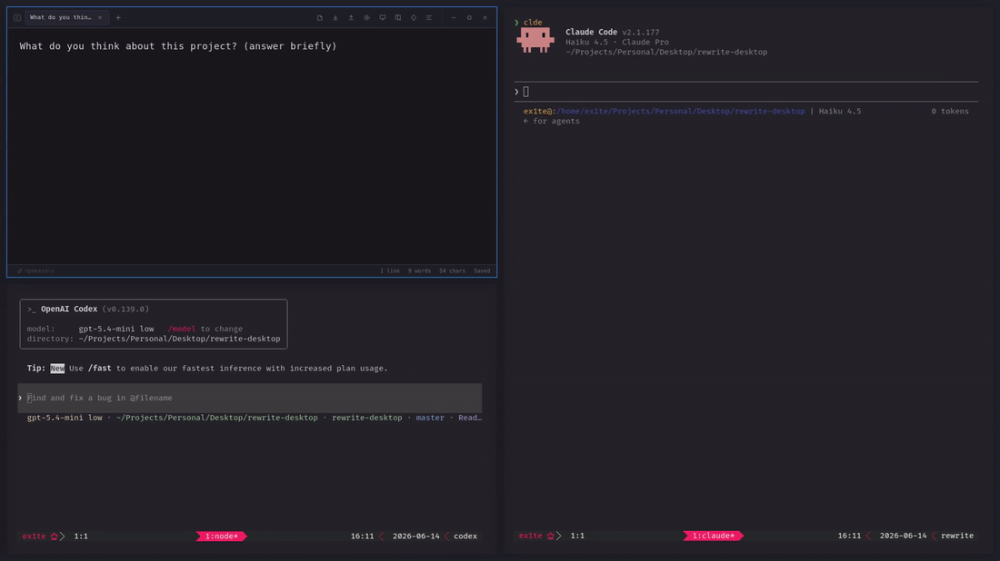
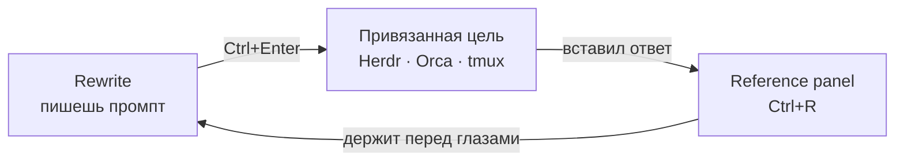

<div align="center">


# Rewrite

**Prompt-first редактор для формулировки LLM-промптов — быстрый, локальный, на клавиатуре.**


[English](README.md) · Русский

</div>

<div align="center">



<sub>Пишешь промпт → <code>Ctrl+Enter</code> → он приезжает в <code>tmux</code>-пейн с твоим агентом
одним блоком и сразу отправленным.</sub>

</div>

Rewrite — минималистичный текстовый редактор вокруг одного сценария: написать
промпт на нормальной поверхности для ввода и отправить его прямо в терминальный
агент, который уже запущен. Возник из конкретной боли — тесный input в Claude
Code и неудобный scrollback в долгих `tmux`-сессиях. Rewrite даёт промпту место,
прежде чем тот уйдёт в агента.

Без бэкенда, без API-ключей, без телеметрии. Всё работает на клиенте.

> **Не** pipeline-builder, **не** база знаний и **не** редактор кода — намеренно.

## Основной цикл



Написал промпт → `Ctrl+Enter` отправляет его в терминал, к которому привязан таб → держишь
ответ агента закреплённым в reference panel, пока пишешь следующий.

> **Отправка работает только в [desktop-сборке](https://github.com/exviolet/rewrite-desktop).**
> Прямая запись в терминал агента идёт через Tauri shell, который есть только у
> desktop-приложения. В обычной вкладке браузера `Ctrl+Enter` откатывается на
> копирование буфера в clipboard. Rewrite — **desktop-first**; браузерная сборка
> это урезанный редактор без моста в терминал.

## Возможности

**Prompt-workflow**
- **Отправка промпта** (`Ctrl+Enter`) — пушит текущий буфер в терминал, к которому
  привязан таб, не отрывая рук от клавиатуры. Поддержаны три вида целей: агенты
  [Herdr](https://herdr.dev), агенты [Orca ADE](https://github.com/stablyai/orca)
  и обычные `tmux`-пейны. Многострочный текст долетает одним блоком, сабмит один.
- **Пикер целей** (`Ctrl+Shift+Enter`) — один список с секциями по источникам:
  выбираешь агента или пейн по имени, а не полагаешься на то, что сейчас в фокусе.
  Незапущенный источник просто не даёт секции.
- **Привязка таба** (`Ctrl+Alt+B` / `Ctrl+Alt+Shift+B`) — закрепить таб за одной целью;
  status bar показывает живую привязку, так что `Ctrl+Enter` всегда летит туда, куда
  надо. Привязка хранит стабильный дескриптор и резолвит живой хендл на каждой
  отправке, поэтому переживает рестарты. **Если цель неоднозначна, Rewrite
  переспросит, а не угадает:** промпт, улетевший не тому агенту, хуже лишнего клика.
- **Живой статус агента** — status bar показывает, чем занят привязанный агент.
  Пока агент работает, это тихая точка; голос он подаёт только когда агент
  остановился и ждёт *твоего* ответа.
- **Фразы-триггеры** (`Ctrl+K`) — переиспользуемые куски промптов. По умолчанию встают
  перед всем промптом (обычно это префиксы-роли); настройкой переключаются на вставку
  в позицию каретки.
- **Reference panel** (`Ctrl+R`) — боковая панель с изменяемой и сохраняемой
  шириной, чтобы держать ответ агента перед глазами при написании ответа.

**Табы, которые масштабируются**
- Табы с drag-and-drop, переживают рестарт (75+ табов ежедневно).
- Авто-имя таба из первой строки; пустые табы авто-очищаются.
- **Workspaces** (`Ctrl+Shift+W`) — группировка табов по проектам; таб-бар
  показывает только активный workspace, пины — свои в каждом.
- **Группы табов** (`Ctrl+G`) — именованные цветные run'ы внутри workspace: группу
  можно свернуть в один чип, перетащить целиком или применить действие сразу к
  нескольким табам через `Ctrl`+клик. Сворачивание только прячет, ничего не закрывает.
- **Tab switcher** (`Ctrl+T`) с живым превью содержимого.
- **Глобальный поиск по табам** (`Ctrl+Shift+D`) — полнотекстовый поиск по всем,
  намеренно сквозной по workspace'ам (это escape hatch из изоляции).
- **Закрепление табов** (`Ctrl+P`) — держать важные черновики в начале таб-бара.

**Работа с текстом**
- **Markdown-редактирование** — `Ctrl+B` / `Ctrl+I` оборачивают (и разворачивают)
  выделение или слово под курсором; `Tab` / `Shift+Tab` делают отступ и вкладывают
  пункты списка; `Enter` продолжает списки, нумерацию, чекбоксы и цитаты, а на пустом
  пункте убирает маркер; скобки, кавычки и бэктики закрываются вокруг выделения,
  третий бэктик подряд разворачивается в блок кода.
- Find & Replace с подсветкой совпадений в реальном времени.
- Массовая замена с diff-превью перед применением.
- **Пресеты замен** — переиспользуемые наборы правил (изначальный сценарий:
  конвертация тона, напр. `You/Your` → совместное `We/Our`).
- Markdown-превью, distraction-free режим, командная палитра (`Ctrl+Shift+P`).

**Под капотом**
- Автосохранение в IndexedDB — закрыл и открыл, всё на месте. Ручного «сохранить»
  нет и не было: `Ctrl+S` лишь дожимает отложенную запись немедленно.
- Закрытие таба ничего не удаляет: он уезжает в архив, который переживает перезапуск,
  и возвращается через `Ctrl+Shift+T`.
- Импорт/экспорт файлов (`.txt`, `.md`) и полный бэкап всей базы.
- Светлая / тёмная / системная тема и настраиваемый шрифт редактора (`Ctrl+,`).

## Быстрый старт

```bash
bun install
bun dev
```

Открой [http://localhost:5173](http://localhost:5173).

```bash
bun run build      # продакшен-сборка
bun run preview    # локально проверить продакшен-сборку
```

> Нужна нативная desktop-версия? Смотри
> [**rewrite-desktop**](https://github.com/exviolet/rewrite-desktop) — обёртка на
> Tauri v2 с нативными диалогами, кастомным title bar и интеграциями с терминалами.

## Горячие клавиши

| Клавиши | Действие |
|---------|----------|
| `Ctrl+Enter` | Отправить буфер в привязанный терминал (Herdr / Orca / tmux) |
| `Ctrl+Shift+Enter` | Пикер целей (Herdr / Orca / tmux) |
| `Ctrl+Alt+B` / `Ctrl+Alt+Shift+B` | Привязать / отвязать таб к терминалу |
| `Ctrl+B` / `Ctrl+I` | Жирный / курсив (выделение или слово под курсором) |
| `Ctrl+M` / `Ctrl+Shift+M` | Инлайн-код / блок кода |
| `Tab` / `Shift+Tab` | Отступ / убрать отступ — вкладывает пункты списка |
| `Ctrl+R` | Reference panel |
| `Ctrl+K` | Фразы-триггеры |
| `Ctrl+T` | Tab switcher (с превью) |
| `Ctrl+Shift+W` | Переключатель workspace |
| `Ctrl+G` | Положить таб в группу (пикер со строкой создания) |
| `Ctrl+Shift+D` | Глобальный поиск по табам |
| `Ctrl+P` | Закрепить / открепить текущий таб |
| `Ctrl+N` / `Ctrl+W` | Новый / закрыть таб |
| `Ctrl+Shift+T` | Открыть закрытый таб |
| `Ctrl+Tab` / `Ctrl+Shift+Tab` | Следующий / предыдущий таб |
| `Ctrl+Shift+PgUp` / `PgDn` | Сдвинуть таб влево / вправо по полосе |
| `Ctrl+Z` / `Ctrl+Shift+Z` | Undo / redo |
| `Ctrl+F` / `Ctrl+H` | Поиск / Поиск и замена |
| `Ctrl+Shift+P` | Командная палитра |
| `Ctrl+S` / `Ctrl+O` | Записать сейчас (и так само) / открыть файл |
| `Ctrl+.` | Сайдбар пресетов |
| `Alt+M` | Markdown-превью |
| `Ctrl+E` | Фокус в редактор |
| `Ctrl+Shift+F` | Distraction-free режим |
| `Ctrl+Shift+A` | Доскроллить к активному табу |
| `Ctrl+,` | Настройки |
| `Ctrl+/` | Справка по горячим клавишам |
| `Escape` | Закрыть панели |

## Стек

| Слой | Выбор |
|------|-------|
| Фреймворк | React 19 + TypeScript (strict) |
| Сборка | Vite + Bun |
| Стили | Tailwind CSS v4 |
| Состояние | Zustand |
| Persistence | IndexedDB (`idb`) |
| Редактор | Нативный `<textarea>` + кастомный overlay — без Monaco/CodeMirror |

## Статус

Личный инструмент, в ежедневном использовании, всё ещё `v0.1.x`. Репозиторий
публичный как портфолио — **работает для меня, но поддержка и стабильность не
гарантируются.** Возможны быстрые breaking changes без предупреждения.

Честный scope, чтобы никто не потратил вечер зря: только Linux, без auto-update,
без миграций данных (breaking changes приезжают clean sweep'ами), issues могут
висеть. Тесты покрывают только чистую логику и слой IndexedDB — компоненты и
хуки сознательно не покрыты. Контрибуции не запрашиваются — форкай свободно.

## Благодарности

В комплекте [JetBrains Mono](https://www.jetbrains.com/lp/mono/) (v2.304) под
[SIL Open Font License 1.1](public/assets/fonts/JetBrainsMono-OFL.txt).
Системный Nerd Font имеет приоритет, если установлен, — чтобы иконки в выводе
агента не ломались.

## Лицензия

[MIT](LICENSE)
